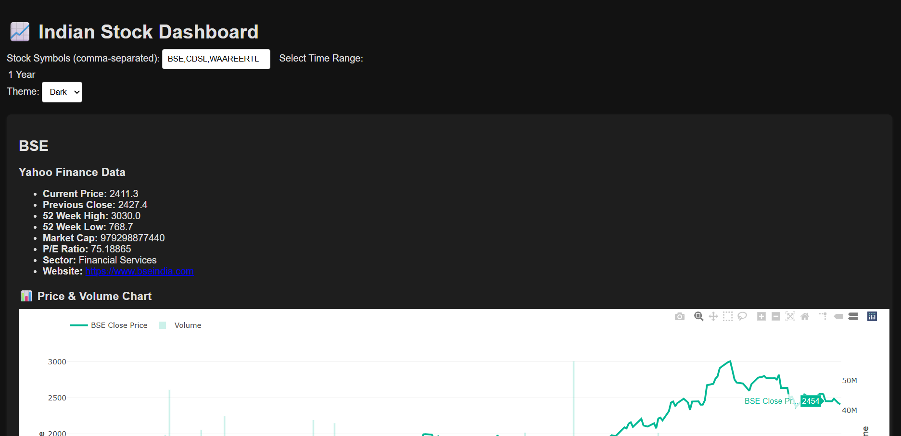

---

### ✅ `README.md`

````markdown
# 📈 Indian Stock Dashboard

A Flask-based stock dashboard for Indian stocks (NSE), built using Yahoo Finance and NSE Tools APIs.  
It supports live data, historical charts, dark mode, multi-stock comparison, and more.

---

## 🚀 Features

- Live stock info (Yahoo Finance + NSE)
- Price + volume chart
- Historical data table (1 week, 1 month, 1 year)
- Dark mode / light mode toggle
- Multi-stock support (comma-separated)
- Responsive web UI using Chart.js
- Option to view historical data in table and chart formats

---

## 📦 Installation Instructions

### 1. Clone the repository

```bash
git clone https://github.com/your-username/your-repo-name.git
cd your-repo-name
````

### 2. Create a virtual environment

```bash
python3 -m venv myenv
```

### 3. Activate the environment

```bash
source myenv/bin/activate  # Linux/macOS
# or
myenv\\Scripts\\activate   # Windows
```

### 4. Install required packages

```bash
pip install -r requirements.txt
```

Or manually:

```bash
pip install flask yfinance nsetools pandas
```

---

## 📂 Project Structure

```
your-project/
├── app.py
├── templates/
│   └── index.html
├── static/
│   └── style.css
├── README.md
└── requirements.txt
```

---

## ▶️ Run the App

```bash
python stock_web_app.py
```

Then visit `http://127.0.0.1:5000/` in your browser.

---

## 🛠 To-Do / Roadmap

* [x] Multi-stock comparison
* [x] Historical charts with volume
* [x] Theme toggle
* [ ] Export to CSV/PDF
* [ ] Threshold alerts
* [ ] Save favorite symbols

---

## 📸 Screenshots

 *(Add your own screenshot)*

---

## 📝 License

MIT License

```

---
